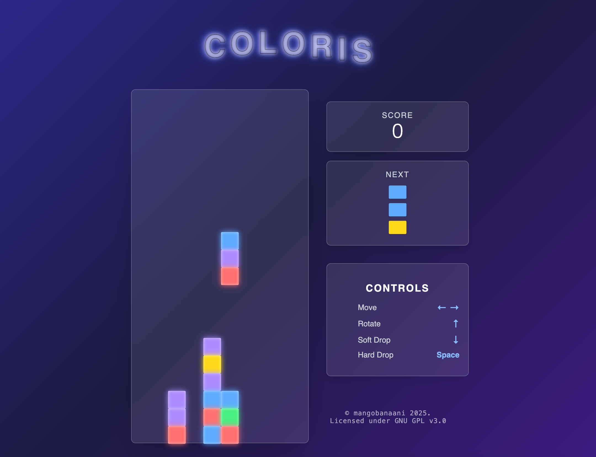

# 🎮 Coloris
**A modern color-matching puzzle game built with Next.js and React**

🎮 **[PLAY LIVE DEMO](https://coloris-dbqe-89t9wwaow-pekkass-projects.vercel.app/)** 🎮

[✨ Play Now](#deployment) | [🎮 Features](#features) | [⚙️ Installation](#installation) | [🧪 Testing](#testing) | [🐳 Docker](#docker) | [🤝 Contributing](#contributing)iv align="center">
  


[](https://nextjs.org/)
[](https://reactjs.org/)
[](https://www.typescriptlang.org/)
[](https://tailwindcss.com/)
[](https://playwright.dev/)
[](https://www.docker.com/)

**A modern color-matching puzzle game built with Next.js and React**

[Play Now](#deployment) | [Installation](#installation) | [Testing](#testing) | [Docker](#docker) | [Contributing](#contributing)

</div>

## 🎬 Preview

<div align="center">
  
</div>

## ⚙️ Installation

Clone the repository and install dependencies:

```bash
# Clone the repository
git clone https://github.com/mangobanaani/coloris.git
cd coloris

# Install dependencies
npm install

# Start development server
npm run dev
```

Your game will be running at [http://localhost:3000](http://localhost:3000)

## 🏗️ Build

```bash
# Build for production
npm run build

# Start production server
npm start
```

## Deployment

### Live Demo
🎮 **[Play the live game here!](https://coloris-dbqe-89t9wwaow-pekkass-projects.vercel.app/)** 🎮

The game is deployed on Vercel with automatic deployment from the main branch. The deployment includes:
- Optimized production build
- Server-side rendering (SSR)
- Responsive design for all devices
- Fast global CDN delivery

### Deploy Your Own
You can easily deploy your own instance:

[](https://vercel.com/new/clone?repository-url=https://github.com/mangobanaani/coloris)

## Testing

Coloris includes tiny testing suite using Playwright:

```bash
# Run all tests
npm test

# Run tests with UI
npm run test:ui

# Debug tests
npm run test:debug
```

## Containerization

Coloris comes with a multi-stage build for efficient container deployment:

```bash
# Using Docker
docker build -t coloris .
docker run -p 3000:3000 coloris

# Using Podman (Docker alternative)
podman build -t coloris .
podman run -p 3000:3000 coloris
```

For more details about container deployment, including Kubernetes configurations and other modern alternatives to Docker, see [DOCKER.md](DOCKER.md).

## Security

Our CI/CD pipeline includes security scanning with:

- **CodeQL Analysis** for code quality and security issues
- **Trivy** for container vulnerability scanning
- **npm audit** for dependency vulnerabilities

## Contributing

Contributions are welcome! Please feel free to submit a Pull Request.

1. Fork the repository
2. Create your feature branch (`git checkout -b feature/amazing-feature`)
3. Commit your changes (`git commit -m 'Add some amazing feature'`)
4. Push to the branch (`git push origin feature/amazing-feature`)
5. Open a Pull Request

## License

This project is licensed under the MIT License - see the [LICENSE](LICENSE) file for details.

## Contact

Project Link: [https://github.com/mangobanaani/coloris](https://github.com/mangobanaani/coloris)

---

## 📬 Contact

Project Link: [https://github.com/mangobanaani/coloris](https://github.com/mangobanaani/coloris)

---

<div align="center">
  <sub>Built with ❤️ by mangobanaani</sub>
</div>
